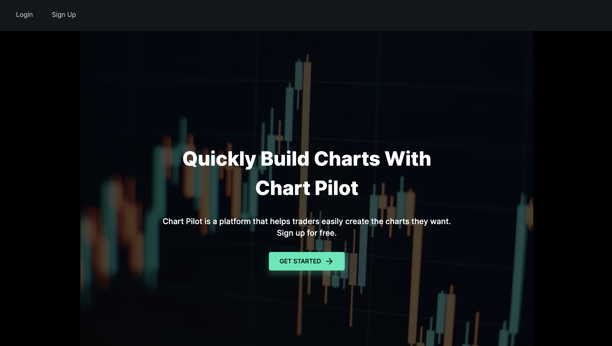
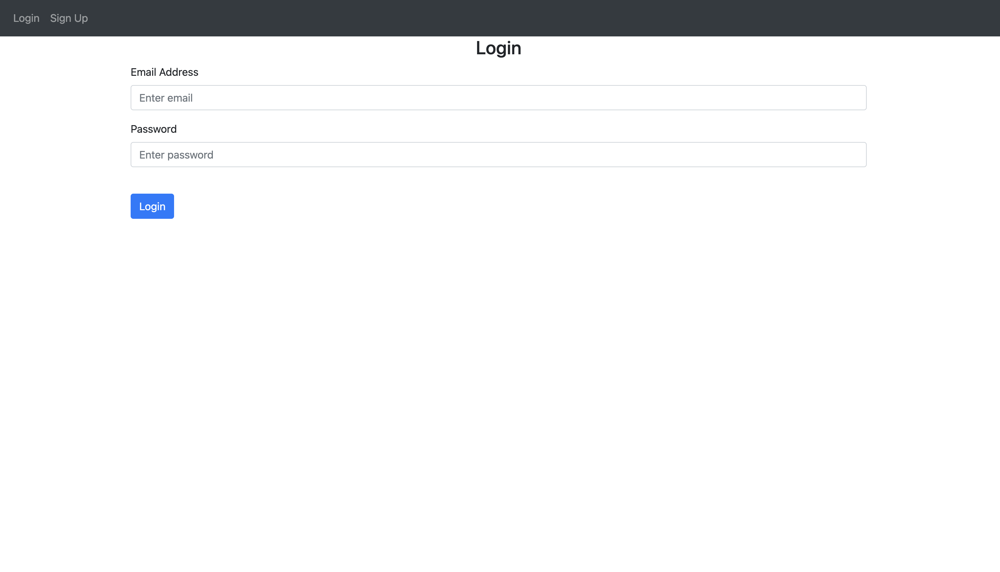
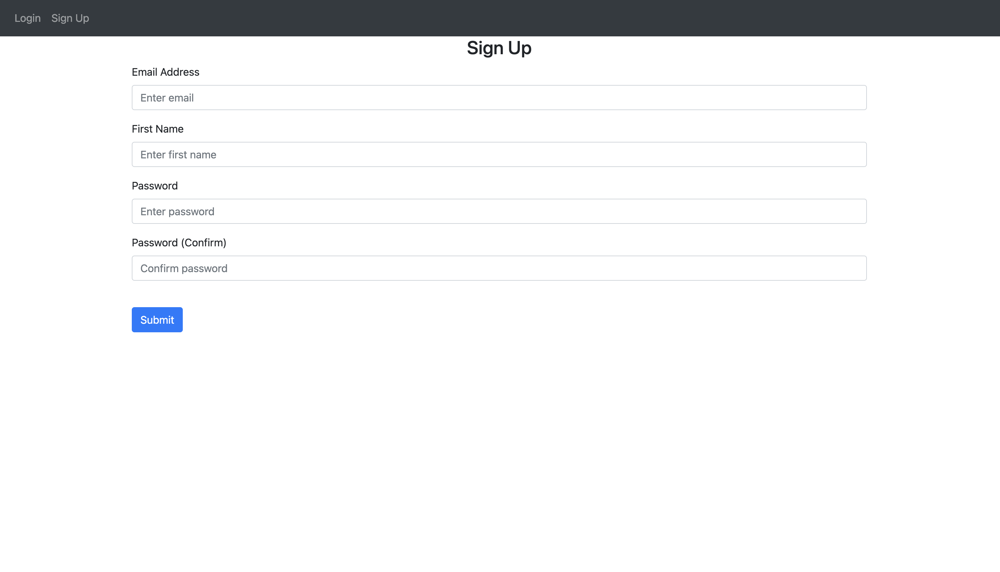
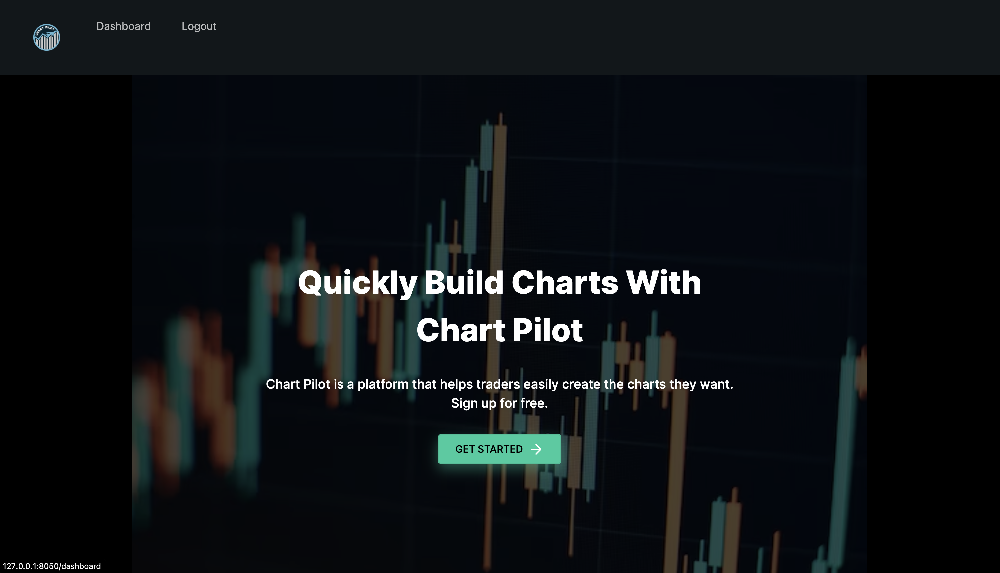
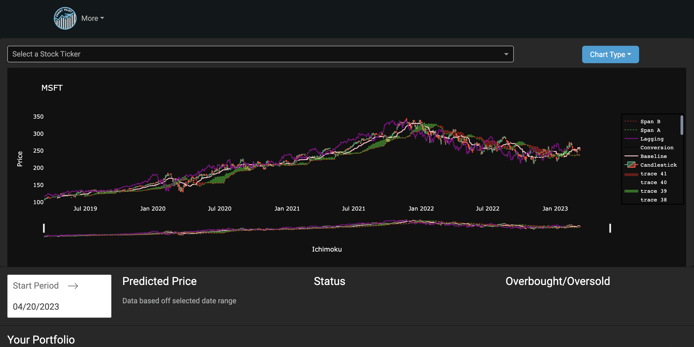
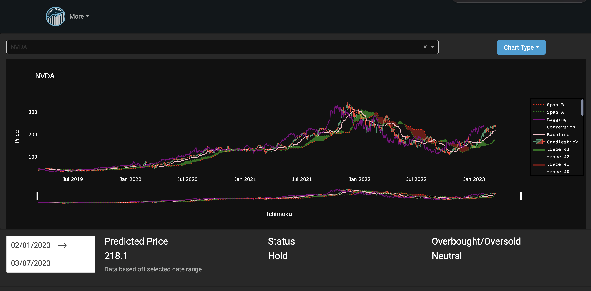

# Chart Pilot

Repository Link: https://github.com/bozzilui/Chart-Pilot

Chart pilot is a simple stock charting application built using flask and dash.

I created this application so that creating charts for your stocks can all be done seamlessly.

To get started, you may copy this repo to your own computer and install the needed requirements
Then simply run the run.py file and the app will be hosted on a local server (usually http://127.0.0.1:8050).

Once you have opened the webpage you with be greeted with this page where you can either login if you already have created a login, or you can sign-up if you have not created a login

The login page looks like this

The Sign up page looks like this 

Once you have logged in or signed up you will be put back onto the main page, where now you will have the option to go to your dashboard. You can access the dashboard by either clicking dashboard at the top of the screen, or clicking the green Get Started button.

You are now on your dashboard where you can view and create your own chart, and also look at calculated statistics of a stock from a specific date range.

You can select the stock you want to view by clicking the search bar near the top of the page, and then searching the ticker of the stock. You can then select a date range for the stock statistics. The data goes from March 11th 2019 until March 8th 2023.

